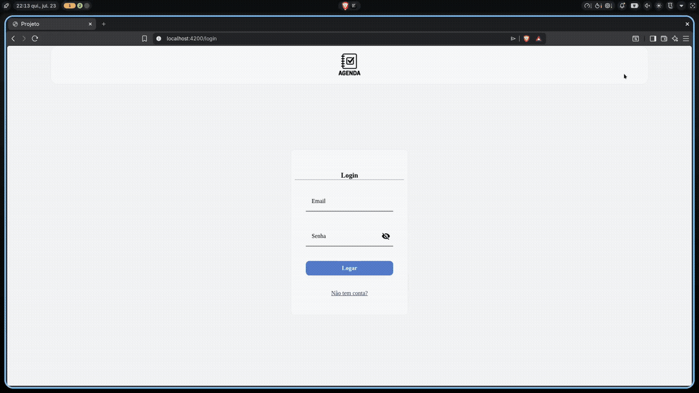

Um projeto simples desenvolvido para praticar Angular e PHP, executado em containers Docker.

O arquivo de design é apenas uma inspiração, não é necessário seguir tudo a risca.



## Funcionalidades

**Cadastro**
- Informar nome completo, cargo (professor ou aluno), e-mail e senha para realizar o cadastro.
- E-mails duplicados não são permitidos.

**Login**
- É necessário informar e-mail e senha corretos para acessar o sistema.

**Criação de Aula (Professor)**
- É necessário informar:
    - Nome da aula.
    - Dia e Horário de início (cada aula tem duração fixa de 50 minutos).
    - Quantidade máxima de alunos permitida.

**Ingresso na Aula (Aluno)**
- O aluno não pode ingressar em uma aula lotada.
- O aluno não pode participar de duas aulas no mesmo horário.

**Requisitos**:
- Aulas que já passaram não podem ser ingressadas por alunos, o mesmo vale para desingressar.
- Apenas o professor que criou a aula pode atualizá-la ou deletá-la.
- O professor não pode definir uma quantidade máxima menor do que a quantidade de alunos já ingressados na aula.

---

## Especificações técnicas

**Front-end:** Desenvolvido em Angular com Angular Material.

**Back-end:** Implementado em PHP.

**Banco de Dados:** Utiliza MongoDB.

**Infraestrutura:** Todos os serviços executam em containers Docker.

---

## Como rodar?

```bash
npm run dev
```
Executa no diretório raiz. Ele faz:
- sobe o container do back-end e do banco;
- instala as dependências do front;
- sobe o servidor de desenvolvimento do front;

```bash
sudo docker compose down
```
Esse comando é necessário para parar a execução do docker compose, que fica em segundo plano.
